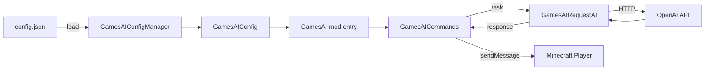

# GamesAI

[](LICENSE)
[](https://minecraft.net)
[](https://fabricmc.net)
[](https://adoptium.net)

> Minecraft Fabric mod — Bring AI assistants into your game world via in-game commands.

---

## Features

- **`/ask` command** — Ask AI questions directly from the Minecraft chat
- **Multi-model support** — Switch between AI models via `-m` / `--model` flags
- **Multi-profile configuration** — Define multiple AI backends (OpenAI, custom endpoints, etc.) with independent API keys, prompts, and base URLs
- **Async execution** — AI requests run off the main thread, never freezing the server
- **Compatible with any OpenAI-compatible API** — Works with OpenAI, local LLMs (Ollama / LM Studio), or self-hosted endpoints
- **Auto-generated config** — First run creates a default `config/games_ai/config.json`, no manual setup needed

---

## Usage

### Commands

```
/ask <your question>
/ask -m <model_name> <your question>
/ask --model <model_name> <your question>
```

| Subcommand | Description |
|------------|-------------|
| `/ask <content>` | Ask AI using the **default** model set in config |
| `/ask -m <model> <content>` | Ask AI using a **specific** model profile |
| `/ask --model <model> <content>` | Same as `-m` (long form) |

### Example

```
/ask Explain how to build a redstone clock
/ask -m deepseek-v3 Write a haiku about creepers
```

---

## Configuration

On first run, a default config is created at:

```
<minecraft_dir>/config/games_ai/config.json
```

### Default Structure

```json
{
  "all_ai": {
    "example_ai": {
      "prompt": "You are a helpful assistant in Minecraft.",
      "ai_name": "[GamesAI]",
      "base_url": "<Your Base URL>",
      "ai_model": "<Your AI Model>",
      "api_key": "<Your API Key>"
    }
  },
  "default_ai": "example_ai"
}
```

### Adding Multiple AI Profiles

```json
{
  "all_ai": {
    "gpt4o": {
      "prompt": "You are a Minecraft expert.",
      "ai_name": "[GPT-4o]",
      "base_url": "https://api.openai.com/v1",
      "ai_model": "gpt-4o",
      "api_key": "sk-xxxxxxxxxxxxxxxxxxxxxxxxxxxxxxxx"
    },
    "local_llama": {
      "prompt": "You are a friendly Minecraft assistant.",
      "ai_name": "[Llama3]",
      "base_url": "http://localhost:11434/v1",
      "ai_model": "llama3",
      "api_key": "ollama"
    }
  },
  "default_ai": "gpt4o"
}
```

> **Tip:** Setting `api_key` to `"ollama"` works as a placeholder for local models that don't require authentication.

---

## Project Structure

```
src/
├── main/java/io/github/pengzixuan30/gamesai/
│   ├── GamesAI.java                  # Mod entry point — init & config loading
│   ├── command/
│   │   └── GamesAICommands.java      # /ask command registration & execution
│   ├── config/
│   │   ├── GamesAIConfig.java        # Config data model (AI profiles)
│   │   └── GamesAIConfigManager.java # Config file read/write (JSON)
│   └── openai/
│       └── GamesAIRequestAI.java     # OpenAI API client & response handling
├── main/resources/
│   ├── fabric.mod.json               # Fabric mod metadata
│   ├── assets/games_ai/icon.png      # Mod icon (optional)
│   └── assets/games_ai/lang/         # Translation files
├── client/java/io/github/pengzixuan30/gamesai/client/
│   └── GamesAIClient.java            # Client-side entry (placeholder)
├── build.gradle                      # Gradle build configuration
├── gradle.properties                 # Minecraft & dependency versions
└── settings.gradle                   # Gradle plugin repositories
```

---

## Architecture Overview



| Class | Responsibility |
|-------|---------------|
| `GamesAI` | Mod lifecycle, config initialization, command hook registration |
| `GamesAICommands` | Command tree (`/ask`, `/ask -m`, `/ask --model`), async dispatch |
| `GamesAIConfig` | POJO with `all_ai` profiles map + `default_ai` selector |
| `GamesAIConfigManager` | JSON serialization (GSON), file I/O to `config/games_ai/` |
| `GamesAIRequestAI` | HTTP client wrapping OpenAI Java SDK, formats chat completions |

---

## Dependencies

| Dependency | Version | Purpose |
|------------|---------|---------|
| Minecraft | 1.21.10 | Game platform |
| Fabric Loader | 0.17.0 | Mod loader |
| Fabric API | 0.134.1+1.21.10 | Fabric hooks & utilities |
| Yarn Mappings | 1.21.10+build.3 | Deobfuscation mappings |
| Fabric Loom | 1.16-SNAPSHOT | Gradle build plugin |
| OpenAI Java SDK | 4.39.1 | HTTP client for OpenAI-compatible APIs |
| GSON | *(transitive)* | JSON parsing (bundled with Fabric) |
| SLF4J | *(transitive)* | Structured logging (bundled with Fabric) |

---

## Building

### Prerequisites

- **JDK 21** (or newer)
- Gradle Wrapper (included — use `gradlew` / `gradlew.bat`)

### Build

```bash
# Clone the repository
git clone https://github.com/pengzixuan30/GamesAI.git
cd GamesAI

# Build the mod
./gradlew build
```

The compiled `.jar` will be at:

```
build/libs/games_ai-1.0.0-SNAPSHOT-1.jar
```

### Run in Dev Environment

```bash
./gradlew runClient    # Launch Minecraft client with the mod
./gradlew runServer    # Launch a local test server
```

---

## Version Compatibility

| Minecraft | Fabric Loader (min) | Fabric API | Status |
|-----------|---------------------|------------|--------|
| 1.21.10   | 0.17.0              | 0.134.1+   | ✅ Current |
| 1.21.11+  | 0.17.0+             | 0.138.4+   | ⚠️ Untested |

> For newer Minecraft versions (≥ 1.21.5 / 26.x), note that `yarn_mappings` is **no longer required** — Fabric Loom directly uses Mojang's official mappings.

### Quick Version Migration

For minor patch upgrades within 1.21.x, edit `gradle.properties`:

```properties
minecraft_version=<new_version>
yarn_mappings=<new_version>+build.X
fabric_version=<api_version>+<new_version>
```

Then rebuild and test. Check [fabricmc.net/develop](https://fabricmc.net/develop/) for recommended version combinations.

---

## License

This project is licensed under the [MIT License](LICENSE).

---

## Acknowledgements

- [FabricMC](https://fabricmc.net) — Modding framework and toolchain
- [OpenAI Java SDK](https://github.com/openai/openai-java)
- Minecraft is a trademark of Mojang / Microsoft. This mod is not affiliated with Mojang.
