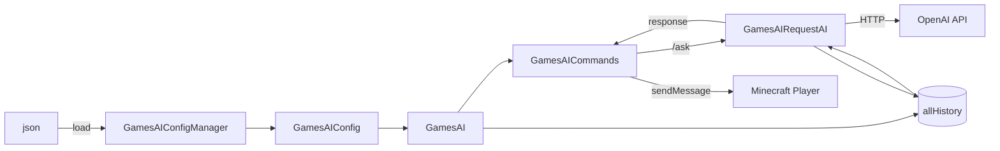

<div align="center">

# GamesAI

[](LICENSE)
[](https://fabricmc.net)
[](https://fabricmc.net)
[](https://adoptium.net)

**English** | [简体中文](README.zh-CN.md)

</div>

---

## Features

- **`/ask` command** — Ask AI questions directly from the Minecraft chat
- **Multi-model support** — Switch between AI models via `-m` / `--model` flags
- **Multi-profile configuration** — Define multiple AI backends (OpenAI, custom endpoints, etc.) with independent API keys, prompts, and base URLs
- **Async execution** — AI requests run off the main thread, never freezing the server
- **Compatible with any OpenAI-compatible API** — Works with OpenAI, local LLMs (Ollama / LM Studio), or self-hosted endpoints
- **Auto-generated config** — First run creates a default `config/games_ai/config.json`, no manual setup needed

---

## Usage

### Commands

```
/ask <your question>
/ask -m <model_name> <your question>
/ask --model <model_name> <your question>
```

| Subcommand | Description |
|------------|-------------|
| `/ask <content>` | Ask AI using the **default** model set in config |
| `/ask -m <model> <content>` | Ask AI using a **specific** model profile |
| `/ask --model <model> <content>` | Same as `-m` (long form) |

### Example

```
/ask Explain how to build a redstone clock
/ask -m deepseek-v3 Write a haiku about creepers
```

---

## Configuration

On first run, a default config is created at:

```
<minecraft_dir>/config/games_ai/config.json
```

### Default Structure

```json
{
  "all_ai": {
    "example_ai": {
      "prompt": "You are a helpful assistant in Minecraft.",
      "ai_name": "[GamesAI]",
      "base_url": "<Your Base URL>",
      "ai_model": "<Your AI Model>",
      "api_key": "<Your API Key>"
    }
  },
  "default_ai": "example_ai"
}
```

### Adding Multiple AI Profiles

```json
{
  "prefix": "[GamesAI]",
  "max_history": 10,
  "all_ai": {
    "gpt4o": {
      "prompt": "You are a Minecraft expert.",
      "ai_name": "[GPT-4o]",
      "base_url": "https://api.openai.com/v1",
      "ai_model": "gpt-4o",
      "api_key": "sk-xxxxxxxxxxxxxxxxxxxxxxxxxxxxxxxx"
    },
    "local_llama": {
      "prompt": "You are a friendly Minecraft assistant.",
      "ai_name": "[Llama3]",
      "base_url": "http://localhost:11434/v1",
      "ai_model": "llama3",
      "api_key": "ollama"
    }
  },
  "default_ai": "gpt4o"
}
```

> **Tip:** For Ollama / local models, set `api_key` to `"ollama"` as a placeholder.

---

## Conversation History

The mod maintains **per-player, per-model** conversation history in memory.

| Setting | Behavior |
|---------|----------|
| `max_history: 10` | Keeps last 10 rounds (20 messages) per player per model |
| Exceeded | Oldest rounds trimmed, keeping complete user-assistant pairs |
| `system` prompt | Injected fresh each request, not stored in history |
| Restart | Server restart clears all history |

---

## Project Structure

```
src/
├── main/java/io/github/pengzixuan30/gamesai/
│   ├── GamesAI.java                  # Mod entry point — init & config loading
│   ├── command/
│   │   └── GamesAICommands.java      # Command registration & execution
│   ├── config/
│   │   ├── GamesAIConfig.java        # Config data model (AI profiles)
│   │   └── GamesAIConfigManager.java # Config file read/write (JSON)
│   ├── help/
│   │   └── GamesAIHelp.java          # Context-sensitive help system
│   ├── openai/
│   │   └── GamesAIRequestAI.java     # OpenAI API client & response handling
│   └── translations/
│       └── GamesAITranslations.java  # I18n translation engine (JSON + GSON)
├── main/resources/
│   ├── fabric.mod.json               # Fabric mod metadata
│   ├── assets/games_ai/icon.png      # Mod icon (optional)
│   └── assets/games_ai/lang/         # Translation files (en_us, zh_cn, ...)
├── client/java/io/github/pengzixuan30/gamesai/client/
│   └── GamesAIClient.java            # Client-side entry (placeholder)
├── build.gradle                      # Gradle build configuration
├── gradle.properties                 # Minecraft & dependency versions
└── settings.gradle                   # Gradle plugin repositories
```

---

## Architecture Overview



| Class | Responsibility |
|-------|---------------|
| `GamesAI` | Mod lifecycle, config, `allHistory` CRUD, `safeTrimHistory`, debug mode |
| `GamesAICommands` | Command tree (`/ask`, `/gamesai`), async dispatch with `CompletableFuture` |
| `GamesAIConfig` | Data model: `prefix`, `max_history`, `lang`, `all_ai` profiles, `default_ai` |
| `GamesAIConfigManager` | GSON serialization, file I/O to `config/games_ai/config.json` (UTF-8) |
| `GamesAIHelp` | Context-sensitive help: `/gamesai` → top-level, `/gamesai config` → subcommands only |
| `GamesAIRequestAI` | OpenAI SDK client, builds messages (`system → history → user`), manages history writes |
| `GamesAITranslations` | I18n engine: loads JSON from `assets/games_ai/lang/`, UTF-8, live reload support |

---

## Building

### Prerequisites

- **JDK 21** (or newer)
- Gradle Wrapper (included — use `gradlew` / `gradlew.bat`)

### Build

```bash
# Clone the repository
git clone https://github.com/pengzixuan30/GamesAI.git
cd GamesAI

# Build the mod
./gradlew build
```

The compiled `.jar` will be at: `build/libs/games_ai-0.1.1-Fabric-xxx.jar`

### Run in Dev Environment

```bash
./gradlew runClient    # Launch Minecraft client with the mod
./gradlew runServer    # Launch a local test server
```

---

### Quick Version Migration

For minor patch upgrades within 1.21.x, edit `gradle.properties`:

```properties
minecraft_version=<new_version>
yarn_mappings=<new_version>+build.X
fabric_version=<api_version>+<new_version>
```

Then rebuild and test. Check [fabricmc.net/develop](https://fabricmc.net/develop/) for recommended version combinations.

---

## Server Notes

- **Permission:** Add `.requires(source -> source.hasPermissionLevel(2))` to restrict `/ask` to admins on public servers
- **History is in-memory only** — server restart clears all conversations
- **API costs** — each `/ask` makes one HTTP request to the configured endpoint

---

## Version Compatibility

| Minecraft | Fabric Loader (min) | Yarn Mappings (min) | Fabric API (min) |
|-----------|---------------------|---------------------|-------------------|
| 1.21.10   | 0.17.0              | 1.21.10+build.3     | 0.134.1+1.21.10  |
| 1.21.9    | 0.17.0              | 1.21.9+build.1      | 0.133.14+1.21.9  |
| 1.21.8    | 0.16.13             | 1.21.8+build.1      | 0.129.0+1.21.8   |
| 1.21.7    | 0.16.13             | 1.21.7+build.8      | 0.128.1+1.21.7   |
| 1.21.6    | 0.16.13             | 1.21.6+build.1      | 0.127.0+1.21.6   |
| 1.21.5    | 0.16.10             | 1.21.5+build.1      | 0.119.5+1.21.5   |
| 1.21.4    | 0.16.9              | 1.21.4+build.8      | 0.110.5+1.21.4   |
| 1.21.3    | 0.16.7              | 1.21.3+build.2      | 0.106.1+1.21.3   |
| 1.21.2    | 0.16.7              | 1.21.2+build.1      | 0.106.1+1.21.2   |
| 1.21.1    | 0.15.11             | 1.21.1+build.3      | 0.102.0+1.21.1   |
| 1.21      | 0.15.11             | 1.21+build.9        | 0.100.1+1.21     |

> More versions coming soon.

---

## License

This project is licensed under the [MIT License](LICENSE).

---

## Acknowledgements

- [FabricMC](https://fabricmc.net) — Modding framework
- [openai/openai-java](https://github.com/openai/openai-java) — The official Java library for the OpenAI API
- Minecraft is a trademark of Mojang / Microsoft. This mod is not affiliated with Mojang.
