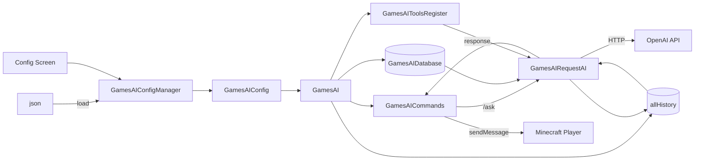

<div align="center">

# GamesAI for Fabric

[](LICENSE)
[](https://fabricmc.net)
[](https://fabricmc.net)
[](https://adoptium.net)

**English** | [简体中文](README.zh-CN.md)

[Report an Issue](https://github.com/PengZixuan30/GamesAI/issues/new) | [Share an Idea](https://github.com/PengZixuan30/GamesAI/discussions/new/choose) | [Join QQ Group](https://qm.qq.com/q/jDQQaUPNmw)

[Go to MCDReforged Version](https://github.com/PengZixuan30/Games_AI)

</div>

> [!NOTE]
> **GamesAI Plugin/Mod QQ Group: 849544707** — Join us to discuss issues, share feedback, and exchange prompt, skills, tools configurations!

> [!NOTE]
> Welcome to GamesAI for Fabric! This mod brings AI assistants into Minecraft — ask questions, manage data, and configure AI backends right from the game.

> [!NOTE]
> Due to the author's limited energy, we will not support versions below 1.21 or non-Fabric loaders.

<details>
<summary>Table of Contents (click to expand)</summary>

- [GamesAI for Fabric](#gamesai-for-fabric)
  - [Installation](#installation)
    - [Prerequisites](#prerequisites)
    - [Steps](#steps)
  - [Usage](#usage)
    - [Ask Commands](#ask-commands)
    - [Management Commands](#management-commands)
      - [General](#general)
      - [History](#history)
      - [Config](#config)
      - [Data](#data)
    - [Client Commands](#client-commands)
    - [In-Game Config Screen](#in-game-config-screen)
  - [Configuration](#configuration)
    - [Default Structure](#default-structure)
    - [1. prefix](#1-prefix)
    - [2. max\_history](#2-max_history)
    - [3. lang](#3-lang)
    - [4. all\_ai](#4-all_ai)
      - [Multi-Profile Example](#multi-profile-example)
    - [5. default\_ai](#5-default_ai)
    - [prompt File Reference](#prompt-file-reference)
  - [Database System](#database-system)
  - [AI Tools](#ai-tools)
    - [Built-in Tools](#built-in-tools)
    - [Custom Tools via Groovy](#custom-tools-via-groovy)
  - [Skills](#skills)
    - [Adding Skills](#adding-skills)
  - [Hot Reload](#hot-reload)
    - [Triggering a Hot Reload](#triggering-a-hot-reload)
    - [What Happens During a Hot Reload](#what-happens-during-a-hot-reload)
  - [Project Structure](#project-structure)
  - [Architecture](#architecture)
  - [Building](#building)
    - [Prerequisites](#prerequisites-1)
    - [Build](#build)
    - [Dev Environment](#dev-environment)
  - [Troubleshooting](#troubleshooting)
    - [`/ask` Returns Errors](#ask-returns-errors)
    - [AI Tools Not Working](#ai-tools-not-working)
    - [Config Screen Issues](#config-screen-issues)
  - [What's New](#whats-new)
    - [Version 0.2.0](#version-020)
      - [🎯 Highlights](#-highlights)
      - [1. Client-side Config Screen](#1-client-side-config-screen)
      - [2. Client Command `/c-ask`](#2-client-command-c-ask)
      - [3. Database, External Prompts, Skills, and Custom Tools](#3-database-external-prompts-skills-and-custom-tools)
      - [4. `/ask` No-History Mode](#4-ask-no-history-mode)
      - [5. AI Tool Calling](#5-ai-tool-calling)
      - [6. `extra_body` Config](#6-extra_body-config)
  - [Version Compatibility](#version-compatibility)
  - [Acknowledgements \& Disclaimer](#acknowledgements--disclaimer)
  - [Sponsorship \& Contributors](#sponsorship--contributors)
  - [License](#license)

</details>

---

## Installation

### Prerequisites

- **Minecraft 1.21+** (or Fabric-compatible version — see [Version Compatibility](#version-compatibility))
- **Fabric Loader** ≥ 0.16.10
- **Fabric API** (latest for your MC version)
- **Java 21** or newer

### Steps

1. Download the latest `.jar` from [Modrinth](https://modrinth.com/mod/gamesai)
2. Place it in your `.minecraft/mods/` folder
3. Launch the game with Fabric Loader
4. A default config file is generated at `config/games_ai/config.json` on first run
5. Edit the config with your API credentials, then reload with `/gamesai reload`

---

Alternatively, download the `.jar` from [GitHub Releases](https://github.com/PengZixuan30/GamesAI/releases) and place it in your `.minecraft/mods/` folder the same way.

---

## Usage

### Ask Commands
| Command | Description |
|---------|-------------|
| `/ask <content>` | Ask AI using the **default** model |
| `/ask -m <model> <content>` | Ask AI using a **specific** model profile |
| `/ask -n <content>` | Ask AI **without** conversation history |
| `/ask -n -m <model> <content>` | Specific model, no history |

> [!NOTE]
> Only short flags (`-m`, `-n`) are supported. Long forms (`--model`, `--no-history`) are not available to avoid duplication in Minecraft's built-in command suggestions.

### Management Commands

#### General

| Command | Permission | Description |
|---------|-----------|-------------|
| `/gamesai help` | Everyone | Show context-sensitive help |
| `/gamesai reload` | Owner (Lv4) | Reload config, tools, and translations |

#### History

| Command | Permission | Description |
|---------|-----------|-------------|
| `/gamesai history clear` | Everyone | Clear your own conversation history |
| `/gamesai history clearall` | Owner (Lv4) | Clear all players' history |

#### Config

| Command | Permission | Description |
|---------|-----------|-------------|
| `/gamesai config lang <lang>` | Owner (Lv4) | Set server language (en_us / zh_cn) |
| `/gamesai config defaultAi <aiID>` | Owner (Lv4) | Set default AI model |
| `/gamesai config maxHistory <value>` | Owner (Lv4) | Set max conversation rounds (≥ 1) |

#### Data

| Command | Permission | Description |
|---------|-----------|-------------|
| `/gamesai data write <key> <value>` | Owner (Lv4) | Write data to database (overwrite) |
| `/gamesai data add <key> <value>` | Owner (Lv4) | Append data to database |
| `/gamesai data del <key>` | Owner (Lv4) | Delete an entry from database |
| `/gamesai data read <key>` | Owner (Lv4) | Read value by key |
| `/gamesai data list` | Owner (Lv4) | List all key-value pairs |
| `/gamesai data list keys` | Owner (Lv4) | List all keys |

### Client Commands

| Command | Description |
|---------|-------------|
| `/c-ask <content>` | Ask AI from the client side (no server command permission needed) |
| `/c-ask -m <model> <content>` | Client-side ask with specific model |
| `/c-ask -n <content>` | Client-side ask without history |
| `/c-ask -n -m <model> <content>` | Client-side ask, specific model, no history |

### In-Game Config Screen

Press **F6** (default) to open the visual configuration screen

- **General Settings** — Edit `prefix`, `max_history`, `lang`, `default_ai` with sliders, text fields, and cycle buttons
- **AI Profiles** — Add, edit, or delete AI backend configurations with a visual editor
- Changes are saved to `config.json` and applied immediately

> [!TIP]
> To rebind the config screen key: **Options → Controls → Key Binds → Miscellaneous → Open GamesAI Config**

---

## Configuration

On first run, a default config is created at:

```
.minecraft/config/games_ai/config.json
```

### Default Structure

```json
{
  "prefix": "[GamesAI]",
  "max_history": 10,
  "lang": "en_us",
  "all_ai": {
    "example_ai": {
      "prompt": "You are a helpful assistant in Minecraft.",
      "ai_name": "[GamesAI]",
      "base_url": "<Your Base URL>",
      "ai_model": "<Your AI Model>",
      "api_key": "<Your API Key>",
      "extra_body": {}
    }
  },
  "default_ai": "example_ai"
}
```

---

### 1. prefix

| Property | Value |
|----------|-------|
| **Type** | `String` |
| **Default** | `[GamesAI]` |

The plugin name used as a prefix in replies. May include Minecraft formatting codes.

---

### 2. max_history

| Property | Value |
|----------|-------|
| **Type** | `int` |
| **Default** | `10` |

The maximum number of conversation turns retained per player per model. Set to `0` to disable history. History is stored in memory and cleared on server restart.

---

### 3. lang

| Property | Value |
|----------|-------|
| **Type** | `String` |
| **Default** | `en_us` |
| **Options** | `en_us`, `zh_cn` |

Server-wide display language. Changes take effect after `/gamesai reload`.

---

### 4. all_ai

| Property | Value |
|----------|-------|
| **Type** | `dict` |

All AI configuration entries. Each entry is a dictionary (the key is the internal AI_ID):

| Field | Description |
|-------|-------------|
| **prompt** | System prompt for this AI. Use `> filename.md` to load from `config/games_ai/prompt/`. |
| **ai_name** | Display name shown in chat (may include Minecraft formatting codes). |
| **base_url** | API endpoint URL (e.g., `https://api.openai.com/v1`). |
| **ai_model** | Model name (e.g., `gpt-4o`, `deepseek-chat`). |
| **api_key** | API authentication key. |
| **extra_body** | Additional parameters passed to the API (e.g., `{"thinking": {"type": "enabled"}}` for DeepSeek). Default: `{}`. |

#### Multi-Profile Example

```json
{
  "all_ai": {
    "gpt4o": {
      "prompt": "You are a Minecraft expert.",
      "ai_name": "[GPT-4o]",
      "base_url": "https://api.openai.com/v1",
      "ai_model": "gpt-4o",
      "api_key": "sk-xxxxxxxxxxxxxxxxxxxxxxxxxxxxxxxx",
      "extra_body": {}
    },
    "deepseek": {
      "prompt": "You are a helpful Minecraft assistant.",
      "ai_name": "[DeepSeek]",
      "base_url": "https://api.deepseek.com",
      "ai_model": "deepseek-chat",
      "api_key": "sk-xxxxxxxxxxxxxxxxxxxxxxxxxxxxxxxx",
      "extra_body": {}
    },
    "local_llama": {
      "prompt": "You are a friendly Minecraft assistant.",
      "ai_name": "[Llama3]",
      "base_url": "http://localhost:11434/v1",
      "ai_model": "llama3",
      "api_key": "ollama",
      "extra_body": {}
    }
  },
  "default_ai": "gpt4o"
}
```

> [!TIP]
> For Ollama / local models, set `api_key` to `"ollama"` as a placeholder.

---

### 5. default_ai

| Property | Value |
|----------|-------|
| **Type** | `String` |

The model used when a player simply uses `/ask`. Must be one of the keys in `all_ai`.

---

### prompt File Reference

Instead of embedding long prompts in `config.json`, you can reference external files:

1. Place your prompt file in `config/games_ai/prompt/` (e.g., `my_prompt.md`)
2. Set `"prompt": "> my_prompt.md"` in the AI profile

The mod automatically reads the file contents at request time. Any text file format (`.md`, `.txt`, etc.) is supported.

---

## Database System

GamesAI includes a SQLite-based public database at `config/games_ai/database/database.db`.

| Command | Description |
|---------|-------------|
| `/gamesai data write <key> <value>` | Write a key-value pair (overwrites existing) |
| `/gamesai data add <key> <value>` | Append value to an existing key (auto-creates) |
| `/gamesai data del <key>` | Delete an entry |
| `/gamesai data read <key>` | Read a value by key |
| `/gamesai data list` | List all key-value pairs |
| `/gamesai data list keys` | List all keys |

The AI can also read and write the database through built-in tools (`ai_read_data`, `ai_write_data`, `ai_add_data`, `ai_del_data`).

---

## AI Tools

The AI can call functions to interact with Minecraft and the database.

### Built-in Tools

| Tool | Parameters | Description |
|------|-----------|-------------|
| `get_online_players` | none | Get the current online player list |
| `get_whitelist_name` | none | Get the server whitelist |
| `add_to_whitelist` | `player` | Add a player to the whitelist |
| `remove_from_whitelist` | `player` | Remove a player from the whitelist |
| `search_minecraft_wiki` | `query` | Search the Minecraft Wiki |
| `calculator` | `expression` | Evaluate a mathematical expression |
| `item_calculator` | `expression`, `single_limit` | Calculate item counts with Minecraft units (stacks/shulkers) |
| `ai_read_data` | `key` | Read a database entry |
| `ai_read_all_keys` | none | Get all database keys |
| `ai_read_all_data` | none | Read all database entries |
| `ai_write_data` | `key`, `value` | Write to database (overwrite) |
| `ai_add_data` | `key`, `value` | Append to database |
| `ai_del_data` | `key` | Delete a database entry |
| `read_skills` | `skills` | Read a skill file |
| `setting_timer` | `duration` | Wait for N seconds before continuing |
| `reload_plugin` | none | Execute `/gamesai reload` |

### Custom Tools via Groovy

You can extend AI capabilities by writing Groovy scripts:

1. Place `.groovy` files in `config/games_ai/tools/`
2. Annotate methods with `@RegisterTool`:

```groovy
import java.util.function.Consumer;
import io.github.pengzixuan30.gamesai.tools.GamesAIToolsRegister;

@GamesAIToolsRegister.RegisterTool(
    name = "my_custom_tool",
    description = "Does something useful",
    parameters = """
        {
          "type": "object",
          "properties": {
            "param": {
              "type": "string",
              "description": "The value to process"
            }
          },
          "required": ["param"]
        }
        """
)
String myCustomTool(Consumer<String> feedback, String aiName, String param) {
    feedback.accept("Executing custom tool...")
    return "Result: ${param} processed"
}
```

> [!IMPORTANT]
> The tool method signature **must** place `Consumer<String> feedback` as the first parameter and `String aiName` as the second, followed by any custom parameters declared in the `parameters` JSON schema.

3. Reload with `/gamesai reload` — tools are discovered and registered automatically.

---

## Skills

Skills are Markdown files that provide the AI with domain-specific knowledge and instructions. The AI can read them via the `read_skills` tool.

### Adding Skills

1. Place `.md` files in `config/games_ai/skills/`
2. Register them in `config/games_ai/skills/skills.json`:

```json
[
  {
    "skills": "my_guide.md",
    "summary": "A guide for building redstone machines"
  }
]
```

3. Reload with `/gamesai reload`

Registered skills appear in the AI's system prompt so it knows what knowledge is available.

---

## Hot Reload

GamesAI provides a hot-reload mechanism that lets you apply configuration, tool, skill, and translation changes without restarting the server.

### Triggering a Hot Reload

Hot reload can be triggered in the following ways:

| Method | Description |
|--------|-------------|
| `/gamesai reload` | Run by an admin (Lv4) to reload all configuration, tools, skills, and translations. |
| `/gamesai config lang <lang>` | Applies the language change immediately. |
| `/gamesai config defaultAi <aiID>` | Applies the default model change immediately. |
| `/gamesai config maxHistory <value>` | Applies the history length change immediately. |
| AI tool `reload_plugin` | Called by the AI after modifying tool code or skill files to apply changes immediately. |
| In-game config screen (F6) | Clicking "Save" writes changes to `config.json` and applies them immediately. |

### What Happens During a Hot Reload

When a hot reload is performed, the mod executes the following steps in order:

1. **Re-read the configuration file** (`config/games_ai/config.json`) — Applies all changes to `prefix`, `max_history`, `lang`, `all_ai`, `default_ai`, etc.
2. **Reload translations** — Applies the selected `lang` (en_us / zh_cn) without restarting.
3. **Reload Skills** (`config/games_ai/skills/skills.json`) — Refreshes the skill index; the available skills list in the AI's system prompt is updated synchronously.
4. **Reload custom tools** (`config/games_ai/tools/*.groovy`) — Hot-loads custom Groovy tool code without restarting the server.

> [!NOTE]
> Hot reload **does not** clear players' chat history. History is stored in memory and is only cleared on server restart.

---

## Project Structure

```
src/
├── main/java/io/github/pengzixuan30/gamesai/
│   ├── GamesAI.java                  # Mod entry point — init & config loading
│   ├── command/
│   │   └── GamesAICommands.java      # Command registration & execution
│   ├── config/
│   │   ├── GamesAIConfig.java        # Config data model (AI profiles, extra_body)
│   │   └── GamesAIConfigManager.java # Config file read/write (JSON, UTF-8)
│   ├── database/
│   │   └── GamesAIDatabase.java      # SQLite public database
│   ├── help/
│   │   └── GamesAIHelp.java          # Context-sensitive help system
│   ├── openai/
│   │   └── GamesAIRequestAI.java     # OpenAI API client & response handling
│   ├── tools/
│   │   ├── GamesAIToolsRegister.java # Tool annotation scanner
│   │   ├── GamesAIBuiltinTools.java  # Built-in tool implementations
│   │   └── GamesAIExternalToolsLoader.java # Groovy tool loader
│   └── translations/
│       └── GamesAITranslations.java  # I18n translation engine
├── main/resources/
│   ├── fabric.mod.json               # Fabric mod metadata
│   └── assets/games_ai/lang/         # Translation files (en_us, zh_cn)
├── client/java/io/github/pengzixuan30/gamesai/client/
│   ├── GamesAIClient.java            # Client entry — key binding, /c-ask
│   └── screen/
│       ├── GamesAIConfigScreen.java           # Main config screen
│       ├── GeneralConfigEditScreen.java       # General settings editor
│       ├── AiProfileConfigEditScreen.java     # AI profile list editor
│       └── AiProfileDetailConfigEditScreen.java # AI profile detail editor
├── build.gradle
├── gradle.properties
└── settings.gradle
```

---

## Architecture


```mermaid
flowchart LR
    Config[json] -->|load| Manager[GamesAIConfigManager]
    Manager --> Model[GamesAIConfig]
    Model --> Main[GamesAI]
    Main --> Cmd[GamesAICommands]
    Cmd -->|/ask| API[GamesAIRequestAI]
    API -->|HTTP| OpenAI[OpenAI API]
    Main --> History[(allHistory)]
    History --> API
    API --> History
    API -->|response| Cmd
    Cmd -->|sendMessage| Player[Minecraft Player]
    Main --> DB[(GamesAIDatabase)]
    DB --> API
    Main --> Tools[GamesAIToolsRegister]
    Tools --> API
    GUI[Config Screen] --> Manager
```

| Class | Responsibility |
|-------|---------------|
| `GamesAI` | Mod lifecycle, config, `allHistory` CRUD, `safeTrimHistory`, debug mode, prompt resolution |
| `GamesAICommands` | Command tree (`/ask`, `/gamesai`), async dispatch with `CompletableFuture` |
| `GamesAIConfig` | Data model: `prefix`, `max_history`, `lang`, `all_ai` profiles (with `extra_body`), `default_ai` |
| `GamesAIConfigManager` | GSON serialization, file I/O to `config/games_ai/config.json` (UTF-8) |
| `GamesAIDatabase` | SQLite key-value store for public data |
| `GamesAIHelp` | Context-sensitive help: `/gamesai` → top-level, `/gamesai config` → subcommands only |
| `GamesAIRequestAI` | OpenAI SDK client, builds messages (`system → history → user`), manages history |
| `GamesAITranslations` | I18n engine: loads JSON from `assets/games_ai/lang/`, UTF-8, live reload |
| `GamesAIToolsRegister` | `@RegisterTool` annotation scanner for built-in & Groovy tools |
| `GamesAIBuiltinTools` | 15+ built-in AI functions (wiki, calculator, whitelist, database, skills) |
| `GamesAIExternalToolsLoader` | Groovy script loader from `config/games_ai/tools/*.groovy` |
| `GamesAIClient` | Client-side entry: F6 hotkey for config GUI, `/c-ask` command |
| `Config Screens` | In-game visual config editor with undo/save, sliders, cycle buttons |

---

## Building

### Prerequisites

- **JDK 21** (or newer)
- Gradle Wrapper (included — use `gradlew` / `gradlew.bat`)

### Build

```bash
git clone https://github.com/PengZixuan30/GamesAI.git
cd GamesAI
./gradlew build
```

The compiled `.jar` will be at: `build/libs/games_ai-*.jar`

### Dev Environment

```bash
./gradlew runClient    # Launch Minecraft client with the mod
./gradlew runServer    # Launch a local test server
```

---

## Troubleshooting

### `/ask` Returns Errors

| Error | Likely Cause | Fix |
|-------|-------------|-----|
| 401 | Invalid API key | Check `api_key` in the AI profile |
| 404 | Wrong base URL or model name | Verify `base_url` and `ai_model` |
| 429 | Rate limited | Wait and retry; reduce request frequency |
| Timeout | Server unreachable | Check network and `base_url` |
| Empty reply | Model returned nothing | Check prompt and model compatibility |

### AI Tools Not Working

- Ensure tools are properly registered: check server log for `[GamesAIToolsRegister] Registered tool: ...`
- For custom Groovy tools, check `config/games_ai/tools/` for syntax errors
- Enable debug mode: `/gamesai debug` to see full prompts and tool call results

### Config Screen Issues

- Press **F6** to open (check key binding in Controls → Miscellaneous)
- Config changes in the GUI are saved only when you click "Save"
- Use "Undo" to revert to the last saved state

---

## What's New

### Version 0.2.0

#### 🎯 Highlights

- **🖥️ Client-side config screen** — A visual in-game configuration GUI (press **F6**).
- **💬 Client command `/c-ask`** — Ask AI from the client without server command permissions.
- **🗄️ Database, external prompts, skills & custom tools** — SQLite public database, `> file.md` prompt references, a skills system, and Groovy custom tools.
- **🧹 No-history mode** — `/ask -n` asks AI without conversation history (aligned with the MCDReforged version).
- **🛠️ AI tool calling** — The AI can now call built-in and custom tools to interact with Minecraft and the database.
- **⚙️ `extra_body` config** — Pass extra provider-specific parameters to the API for more flexibility.

#### 1. Client-side Config Screen

Press **F6** (default) to open the visual configuration screen. Edit general settings and AI profiles with sliders, text fields, and cycle buttons — changes are saved to `config.json` and applied immediately. See [In-Game Config Screen](#in-game-config-screen).

#### 2. Client Command `/c-ask`

The new client-side `/c-ask` command lets players ask AI from the client without needing server command permissions. It supports `-m` (model) and `-n` (no-history) flags, just like `/ask`. See [Client Commands](#client-commands).

#### 3. Database, External Prompts, Skills, and Custom Tools

- **Public database** — SQLite key-value store accessible by AI tools and commands. See [Database System](#database-system).
- **External prompt files** — Reference external `.md` files as system prompts via `> filename`. See [prompt File Reference](#prompt-file-reference).
- **Skills** — Markdown files that give the AI domain-specific knowledge. See [Skills](#skills).
- **Custom tools** — Extend AI capabilities with Groovy scripts. See [Custom Tools via Groovy](#custom-tools-via-groovy).

#### 4. `/ask` No-History Mode

Use `/ask -n <content>` to ask AI without using conversation history (aligned with the MCDReforged version's `!!ask -n`). See [Ask Commands](#ask-commands).

#### 5. AI Tool Calling

The AI can now call built-in tools (Minecraft Wiki search, calculator, whitelist, database, skills, etc.) and custom Groovy tools to perform actions in Minecraft. See [AI Tools](#ai-tools).

#### 6. `extra_body` Config

Each AI profile now supports an `extra_body` field for passing extra provider-specific parameters (e.g. DeepSeek's `{"thinking": {"type": "enabled"}}`). See [4. all_ai](#4-all_ai).

---

## Version Compatibility

| Minecraft | Fabric Loader (min) | Yarn Mappings (min) | Fabric API (min) |
|-----------|---------------------|---------------------|-------------------|
| 26.2      | 0.18.4              | -                   | 0.152.1+26.2     |
| 26.1.2    | 0.18.4              | -                   | 0.145.4+26.1.2   |
| 26.1.1    | 0.18.4              | -                   | 0.145.2+26.1.1   |
| 26.1      | 0.18.4              | -                   | 0.144.0+26.1     |
| 1.21.11   | 0.17.3              | 1.21.11+build.6     | 0.139.4+1.21.11  |
| 1.21.10   | 0.17.0              | 1.21.10+build.3     | 0.134.1+1.21.10  |
| 1.21.9    | 0.17.0              | 1.21.9+build.1      | 0.133.14+1.21.9  |
| 1.21.8    | 0.16.13             | 1.21.8+build.1      | 0.129.0+1.21.8   |
| 1.21.7    | 0.16.13             | 1.21.7+build.8      | 0.128.1+1.21.7   |
| 1.21.6    | 0.16.13             | 1.21.6+build.1      | 0.127.0+1.21.6   |
| 1.21.5    | 0.16.10             | 1.21.5+build.1      | 0.119.5+1.21.5   |
| 1.21.4    | 0.16.9              | 1.21.4+build.8      | 0.110.5+1.21.4   |
| 1.21.3    | 0.16.7              | 1.21.3+build.2      | 0.106.1+1.21.3   |
| 1.21.2    | 0.16.7              | 1.21.2+build.1      | 0.106.1+1.21.2   |
| 1.21.1    | 0.15.11             | 1.21.1+build.3      | 0.102.0+1.21.1   |
| 1.21      | 0.15.11             | 1.21+build.9        | 0.100.1+1.21     |

> Due to the author's limited energy, we will not support versions below 1.21 or non-Fabric loaders.

---

## Acknowledgements & Disclaimer

- [DA100](https://github.com/DA100102) — Logo design for this mod
- [FabricMC](https://fabricmc.net) — Modding framework
- [openai/openai-java](https://github.com/openai/openai-java) — Official OpenAI Java library
- Minecraft is a trademark of Mojang / Microsoft. This mod is not affiliated with Mojang.

All content generated by AI (LLM) models is unrelated to this mod.

All consequences arising from custom tools are unrelated to this mod.

---

## Sponsorship & Contributors

Sponsorship address: [Afdian](https://ifdian.net/a/yello)

Those who sponsor GamesAI will appear in the following sponsor list (currently no sponsors):

| # | Sponsor | Amount | Date |
|---|---------|--------|------|
| - | - | - | - |

---

## License

- **Source code** is licensed under the MIT License — see the [LICENSE](./LICENSE) file for details.
- **Logo and visual assets** are proprietary and all rights reserved by **冬天衣服不错**. You may view and share them for personal, non‑commercial use, but any modification or commercial use requires prior written permission.
