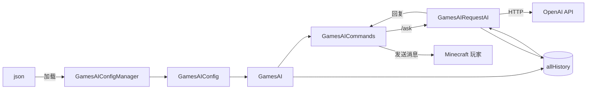

# GamesAI

[](LICENSE)
[](https://fabricmc.net)
[](https://fabricmc.net)
[](https://adoptium.net)

> Minecraft Fabric 模组 —— 在游戏中与 AI 对话

🌐 [English](README.md) | **简体中文**

---

## 功能

- **`/ask` 指令** —— 在聊天框中直接向 AI 提问
- **多模型切换** —— 通过 `-m` / `--model` 指定不同模型
- **多后端配置** —— 同时配置多个 AI（OpenAI、自定义端点等），独立 API Key、提示词和地址
- **异步请求** —— AI 思考时不卡服
- **兼容任意 OpenAI 兼容 API** —— 支持 OpenAI、本地 LLM（Ollama / LM Studio）、自建服务
- **自动生成配置** —— 首次运行自动创建 `config/games_ai/config.json`

---

## 使用

### 指令

```
/ask <你的问题>
/ask -m <模型名> <你的问题>
/ask --model <模型名> <你的问题>
```

| 指令 | 说明 |
|------|------|
| `/ask <内容>` | 使用**默认**模型提问 |
| `/ask -m <模型> <内容>` | 使用**指定**模型提问 |
| `/ask --model <模型> <内容>` | 同 `-m`（长格式） |

### 示例

```
/ask 怎样建造一个红石钟？
/ask -m deepseek-v3 写一首关于爬行者的俳句
```

---

## 配置

首次运行后，配置文件自动生成在：

```
<minecraft 目录>/config/games_ai/config.json
```

### 默认结构

```json
{
  "all_ai": {
    "example_ai": {
      "prompt": "你是一个有用的 Minecraft 助手。",
      "ai_name": "[GamesAI]",
      "base_url": "<你的 Base URL>",
      "ai_model": "<你的 AI 模型>",
      "api_key": "<你的 API Key>"
    }
  },
  "default_ai": "example_ai"
}
```

### 多 AI 配置示例

```json
{
  "prefix": "[GamesAI]",
  "max_history": 10,
  "all_ai": {
    "gpt4o": {
      "prompt": "你是一个 Minecraft 专家。",
      "ai_name": "[GPT-4o]",
      "base_url": "https://api.openai.com/v1",
      "ai_model": "gpt-4o",
      "api_key": "sk-xxxxxxxxxxxxxxxxxxxxxxxxxxxxxxxx"
    },
    "local_llama": {
      "prompt": "你是一个友好的 Minecraft 助手。",
      "ai_name": "[Llama3]",
      "base_url": "http://localhost:11434/v1",
      "ai_model": "llama3",
      "api_key": "ollama"
    }
  },
  "default_ai": "gpt4o"
}
```

> **提示：** Ollama / 本地模型请将 `api_key` 设为 `"ollama"` 作为占位符。

---

## 对话历史

模组会在**内存中**为每个玩家、每个模型维护独立的对话历史。

| 设置 | 行为 |
|------|------|
| `max_history: 10` | 每个玩家每个模型保留最近 10 轮（20 条消息） |
| 超限 | 自动裁剪最旧的轮次，保留完整的问答对 |
| `system` 提示词 | 每次请求动态注入，不存入历史 |
| 重启 | 服务端重启后历史清空 |

---

## 项目结构

```
src/
├── main/java/io/github/pengzixuan30/gamesai/
│   ├── GamesAI.java                  # 模组入口 —— 初始化 & 配置加载
│   ├── command/
│   │   └── GamesAICommands.java      # /ask 指令注册 & 执行
│   ├── config/
│   │   ├── GamesAIConfig.java        # 配置数据模型
│   │   └── GamesAIConfigManager.java # JSON 读写
│   └── openai/
│       └── GamesAIRequestAI.java     # OpenAI API 客户端
├── main/resources/
│   ├── fabric.mod.json               # Fabric 模组元数据
│   └── assets/games_ai/lang/         # 翻译文件
├── client/                           # 客户端入口（占位）
├── build.gradle
├── gradle.properties
└── settings.gradle
```

---

## 架构



| 类 | 职责 |
|----|------|
| `GamesAI` | 模组生命周期、配置、`allHistory` 增删改查、`safeTrimHistory` |
| `GamesAICommands` | 指令树（`/ask`、`/ask -m`、帮助）、`CompletableFuture` 异步调度 |
| `GamesAIConfig` | 数据模型：`prefix`、`max_history`、`all_ai` 配置列表、`default_ai` |
| `GamesAIConfigManager` | GSON 序列化，文件读写 `config/games_ai/config.json` |
| `GamesAIRequestAI` | OpenAI SDK 客户端，构建消息（`system → history → user`），管理历史写入 |

---

## 构建

### 前提

- **JDK 21** 或更高
- Gradle Wrapper（已包含，使用 `gradlew` / `gradlew.bat`）

### 构建

```bash
git clone https://github.com/pengzixuan30/GamesAI.git
cd GamesAI
./gradlew build
```

产物：`build/libs/games_ai-1.0.0-SNAPSHOT-1.jar`

### 开发环境

```bash
./gradlew runClient    # 启动 Minecraft 客户端（含模组）
./gradlew runServer    # 启动本地测试服务端
```

---

## 服务端注意事项

- **权限：** 建议添加 `.requires(source -> source.hasPermissionLevel(2))` 限制 `/ask` 仅管理员可用
- **历史仅存内存** —— 服务端重启后全部清空
- **API 费用** —— 每次 `/ask` 向配置的端点发送一次 HTTP 请求

---

## 版本兼容性

| Minecraft | Fabric Loader（最低） | Yarn Mappings（最低） | Fabric API（最低） |
|-----------|----------------------|-----------------------|--------------------|
| 1.21.10   | 0.17.0               | 1.21.10+build.3       | 0.134.1+1.21.10    |

> 更多版本即将添加。

---

## 许可

[MIT License](LICENSE)

---

## 致谢

- [FabricMC](https://fabricmc.net) —— 模组框架
- [openai/openai-java](https://github.com/openai/openai-java) —— OpenAI 官方 Java 库
- Minecraft 是 Mojang / Microsoft 的商标。本模组与 Mojang 无关。
