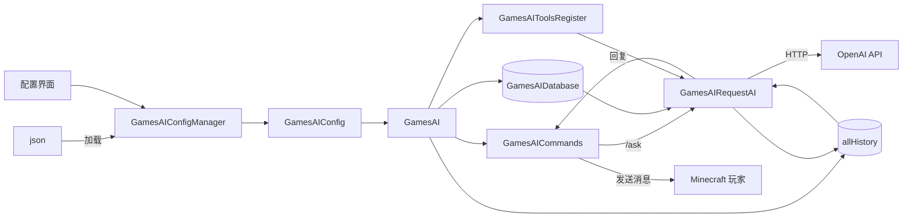

<div align="center">

# GamesAI for Fabric

[](LICENSE)
[](https://fabricmc.net)
[](https://fabricmc.net)
[](https://adoptium.net)

[English](README.md) | **简体中文**

[报告问题](https://github.com/PengZixuan30/GamesAI/issues/new) | [分享想法](https://github.com/PengZixuan30/GamesAI/discussions/new/choose) | [加入 QQ 群](https://qm.qq.com/q/jDQQaUPNmw)

[转到 MCDReforged 版本](https://github.com/PengZixuan30/Games_AI)

</div>

> [!NOTE]
> **GamesAI 插件/模组 QQ 群：849544707** —— 加入我们一起讨论问题、反馈意见、交流 prompt、skills、tools 配置！

> [!NOTE]
> 欢迎使用 GamesAI for Fabric！这个模组将 AI 助手带入 Minecraft —— 在游戏中提问、管理数据、配置 AI 后端。

> [!NOTE]
> 由于作者精力有限，我们不会支持1.21以下的版本和非fabric加载器的版本

<details>
<summary>目录（点击展开）</summary>

- [GamesAI for Fabric](#gamesai-for-fabric)
  - [安装](#安装)
    - [前提](#前提)
    - [步骤](#步骤)
  - [使用](#使用)
    - [AI 提问指令](#ai-提问指令)
    - [管理指令](#管理指令)
      - [通用](#通用)
      - [历史](#历史)
      - [配置](#配置)
      - [数据](#数据)
    - [客户端指令](#客户端指令)
    - [游戏内配置界面](#游戏内配置界面)
  - [配置](#配置-1)
    - [默认结构](#默认结构)
    - [1. prefix](#1-prefix)
    - [2. max\_history](#2-max_history)
    - [3. lang](#3-lang)
    - [4. all\_ai](#4-all_ai)
      - [多 AI 配置示例](#多-ai-配置示例)
    - [5. default\_ai](#5-default_ai)
    - [prompt 文件引用](#prompt-文件引用)
  - [数据库系统](#数据库系统)
  - [AI 工具](#ai-工具)
    - [内置工具](#内置工具)
    - [Groovy 自定义工具](#groovy-自定义工具)
  - [Skills](#skills)
    - [添加 Skills](#添加-skills)
  - [热重载](#热重载)
    - [触发热重载](#触发热重载)
    - [重载期间发生了什么](#重载期间发生了什么)
  - [项目结构](#项目结构)
  - [架构](#架构)
  - [构建](#构建)
    - [前提](#前提-1)
    - [构建](#构建-1)
    - [开发环境](#开发环境)
  - [故障排查](#故障排查)
    - [`/ask` 返回错误](#ask-返回错误)
    - [AI 工具不工作](#ai-工具不工作)
    - [配置界面问题](#配置界面问题)
  - [本次更新](#本次更新)
    - [Version 0.2.0](#version-020)
      - [🎯 核心亮点](#-核心亮点)
      - [1. 客户端配置页面](#1-客户端配置页面)
      - [2. 客户端指令 `/c-ask`](#2-客户端指令-c-ask)
      - [3. 数据库、外部提示词、Skills 与自定义工具](#3-数据库外部提示词skills-与自定义工具)
      - [4. `/ask` 无历史模式](#4-ask-无历史模式)
      - [5. AI 调用工具](#5-ai-调用工具)
      - [6. `extra_body` 配置](#6-extra_body-配置)
  - [版本兼容性](#版本兼容性)
  - [鸣谢与声明](#鸣谢与声明)
  - [赞助与贡献者名单](#赞助与贡献者名单)
  - [许可证](#许可证)

</details>

---

## 安装

### 前提

- **Minecraft 1.21+**（或 Fabric 兼容版本——见[版本兼容性](#版本兼容性)）
- **Fabric Loader** ≥ 0.16.10
- **Fabric API**（对应 MC 版本的最新版）
- **Java 21** 或更高

### 步骤

1. 从 [Modrinth](https://modrinth.com/mod/gamesai) 下载最新 `.jar`
2. 放入 `.minecraft/mods/` 文件夹
3. 用 Fabric Loader 启动游戏
4. 首次运行后自动在 `config/games_ai/config.json` 生成默认配置
5. 编辑配置填入 API 凭据，然后 `/gamesai reload` 重载

---

或者，从 [GitHub Releases](https://github.com/PengZixuan30/GamesAI/releases) 下载 `.jar`，用同样的方式放入 `.minecraft/mods/` 文件夹。

---

## 使用

### AI 提问指令
| 指令 | 说明 |
|------|------|
| `/ask <内容>` | 使用**默认**模型提问 |
| `/ask -m <模型> <内容>` | 使用**指定**模型提问 |
| `/ask -n <内容>` | **不带**对话历史提问 |
| `/ask -n -m <模型> <内容>` | 指定模型，不带历史 |

> [!NOTE]
> 仅支持短标志（`-m`、`-n`）。为避免与 Minecraft 自带命令补全重复注册，不支持长格式（`--model`、`--no-history`）。

### 管理指令

#### 通用

| 指令 | 权限 | 说明 |
|------|------|------|
| `/gamesai help` | 所有人 | 显示上下文相关帮助 |
| `/gamesai reload` | 所有者（Lv4） | 重载配置、工具和语言文件 |

#### 历史

| 指令 | 权限 | 说明 |
|------|------|------|
| `/gamesai history clear` | 所有人 | 清除自己的对话历史 |
| `/gamesai history clearall` | 所有者（Lv4） | 清除所有玩家历史 |

#### 配置

| 指令 | 权限 | 说明 |
|------|------|------|
| `/gamesai config lang <语言>` | 所有者（Lv4） | 设置服务器语言（en_us / zh_cn） |
| `/gamesai config defaultAi <aiID>` | 所有者（Lv4） | 设置默认 AI 模型 |
| `/gamesai config maxHistory <值>` | 所有者（Lv4） | 设置最大对话轮数（≥ 1） |

#### 数据

| 指令 | 权限 | 说明 |
|------|------|------|
| `/gamesai data write <键> <值>` | 所有者（Lv4） | 向数据库写入数据（覆写模式） |
| `/gamesai data add <键> <值>` | 所有者（Lv4） | 向数据库追加数据 |
| `/gamesai data del <键>` | 所有者（Lv4） | 从数据库删除一条数据 |
| `/gamesai data read <键>` | 所有者（Lv4） | 读取数据库中指定键的值 |
| `/gamesai data list` | 所有者（Lv4） | 列出所有键值对 |
| `/gamesai data list keys` | 所有者（Lv4） | 列出所有键 |

### 客户端指令

| 指令 | 说明 |
|------|------|
| `/c-ask <内容>` | 从客户端向 AI 提问（无需服务端指令权限） |
| `/c-ask -m <模型> <内容>` | 客户端提问，指定模型 |
| `/c-ask -n <内容>` | 客户端提问，不带历史 |
| `/c-ask -n -m <模型> <内容>` | 客户端提问，指定模型，不带历史 |

### 游戏内配置界面

按 **F6**（默认）打开可视化配置界面

- **通用设置** —— 编辑 `prefix`、`max_history`、`lang`、`default_ai`，支持滑杆、文本框和循环按钮
- **AI 模型配置** —— 添加、编辑、删除 AI 后端配置
- 修改即时保存到 `config.json`，点击"保存"后立即生效

> [!TIP]
> 重新绑定快捷键：**选项 → 控制 → 按键绑定 → 杂项 → 打开 GamesAI 配置**

---

## 配置

首次运行后，配置文件自动生成在：

```
.minecraft/config/games_ai/config.json
```

### 默认结构

```json
{
  "prefix": "[GamesAI]",
  "max_history": 10,
  "lang": "en_us",
  "all_ai": {
    "example_ai": {
      "prompt": "You are a helpful assistant in Minecraft.",
      "ai_name": "[GamesAI]",
      "base_url": "<Your Base URL>",
      "ai_model": "<Your AI Model>",
      "api_key": "<Your API Key>",
      "extra_body": {}
    }
  },
  "default_ai": "example_ai"
}
```

---

### 1. prefix

| 属性 | 值 |
|------|-----|
| **类型** | `String` |
| **默认值** | `[GamesAI]` |

插件回复前缀，可包含 Minecraft 格式化代码。

---

### 2. max_history

| 属性 | 值 |
|------|-----|
| **类型** | `int` |
| **默认值** | `10` |

每个玩家每个模型最多保留的对话轮数。设为 `0` 完全禁用历史。历史仅存内存，服务端重启后清空。

---

### 3. lang

| 属性 | 值 |
|------|-----|
| **类型** | `String` |
| **默认值** | `en_us` |
| **可选值** | `en_us`, `zh_cn` |

全服显示语言。通过 `/gamesai reload` 生效。

---

### 4. all_ai

| 属性 | 值 |
|------|-----|
| **类型** | `dict` |

所有 AI 配置条目。每个条目为一个字典（键为内部 AI_ID）：

| 字段 | 说明 |
|------|------|
| **prompt** | 系统提示词。使用 `> 文件名.md` 从 `config/games_ai/prompt/` 加载。 |
| **ai_name** | 聊天中显示的 AI 名称（可含 Minecraft 格式化代码）。 |
| **base_url** | API 端点地址（如 `https://api.openai.com/v1`）。 |
| **ai_model** | 模型名（如 `gpt-4o`、`deepseek-chat`）。 |
| **api_key** | API 认证密钥。 |
| **extra_body** | 传递给 API 的额外参数（如 DeepSeek 的 `{"thinking": {"type": "enabled"}}`）。默认：`{}`。 |

#### 多 AI 配置示例

```json
{
  "all_ai": {
    "gpt4o": {
      "prompt": "你是一个 Minecraft 专家。",
      "ai_name": "[GPT-4o]",
      "base_url": "https://api.openai.com/v1",
      "ai_model": "gpt-4o",
      "api_key": "sk-xxxxxxxxxxxxxxxxxxxxxxxxxxxxxxxx",
      "extra_body": {}
    },
    "deepseek": {
      "prompt": "你是一个有用的 Minecraft 助手。",
      "ai_name": "[DeepSeek]",
      "base_url": "https://api.deepseek.com",
      "ai_model": "deepseek-chat",
      "api_key": "sk-xxxxxxxxxxxxxxxxxxxxxxxxxxxxxxxx",
      "extra_body": {}
    },
    "local_llama": {
      "prompt": "你是一个友好的 Minecraft 助手。",
      "ai_name": "[Llama3]",
      "base_url": "http://localhost:11434/v1",
      "ai_model": "llama3",
      "api_key": "ollama",
      "extra_body": {}
    }
  },
  "default_ai": "gpt4o"
}
```

> [!TIP]
> Ollama / 本地模型请将 `api_key` 设为 `"ollama"` 作为占位符。

---

### 5. default_ai

| 属性 | 值 |
|------|-----|
| **类型** | `String` |

玩家直接使用 `/ask` 时使用的模型。必须是 `all_ai` 中的某个键。

---

### prompt 文件引用

不想把长提示词塞进 `config.json`？可以引用外部文件：

1. 将提示词文件放入 `config/games_ai/prompt/`（如 `my_prompt.md`）
2. 在 AI 配置中设置 `"prompt": "> my_prompt.md"`

模组在每次请求时自动读取文件内容。支持任意文本格式（`.md`、`.txt` 等）。

---

## 数据库系统

GamesAI 内置 SQLite 公共数据库，位于 `config/games_ai/database/database.db`。

| 指令 | 说明 |
|------|------|
| `/gamesai data write <键> <值>` | 写入键值对（覆写已有键） |
| `/gamesai data add <键> <值>` | 向已有键追加值（自动创建） |
| `/gamesai data del <键>` | 删除一条数据 |
| `/gamesai data read <键>` | 按键读取值 |
| `/gamesai data list` | 列出所有键值对 |
| `/gamesai data list keys` | 列出所有键 |

AI 也可通过内置工具（`ai_read_data`、`ai_write_data`、`ai_add_data`、`ai_del_data`）读写数据库。

---

## AI 工具

AI 可以调用函数与 Minecraft 和数据库交互。

### 内置工具

| 工具 | 参数 | 说明 |
|------|------|------|
| `get_online_players` | 无 | 获取当前在线玩家列表 |
| `get_whitelist_name` | 无 | 获取服务器白名单 |
| `add_to_whitelist` | `player` | 添加玩家到白名单 |
| `remove_from_whitelist` | `player` | 从白名单移除玩家 |
| `search_minecraft_wiki` | `query` | 搜索 Minecraft Wiki |
| `calculator` | `expression` | 计算数学表达式 |
| `item_calculator` | `expression`, `single_limit` | 计算物品数量并转换为 MC 单位（盒/组/个） |
| `ai_read_data` | `key` | 读取数据库条目 |
| `ai_read_all_keys` | 无 | 获取所有数据库键 |
| `ai_read_all_data` | 无 | 读取所有数据库条目 |
| `ai_write_data` | `key`, `value` | 写入数据库（覆写） |
| `ai_add_data` | `key`, `value` | 追加到数据库 |
| `ai_del_data` | `key` | 删除数据库条目 |
| `read_skills` | `skills` | 读取技能文件 |
| `setting_timer` | `duration` | 等待 N 秒后继续 |
| `reload_plugin` | 无 | 执行 `/gamesai reload` |

### Groovy 自定义工具

通过 Groovy 脚本扩展 AI 能力：

1. 将 `.groovy` 文件放入 `config/games_ai/tools/`
2. 用 `@RegisterTool` 注解方法：

```groovy
import java.util.function.Consumer;
import io.github.pengzixuan30.gamesai.tools.GamesAIToolsRegister;

@GamesAIToolsRegister.RegisterTool(
    name = "my_custom_tool",
    description = "做一些有用的事",
    parameters = """
        {
          "type": "object",
          "properties": {
            "param": {
              "type": "string",
              "description": "要处理的值"
            }
          },
          "required": ["param"]
        }
        """
)
String myCustomTool(Consumer<String> feedback, String aiName, String param) {
    feedback.accept("正在执行自定义工具...")
    return "结果: ${param} 已处理"
}
```

> [!IMPORTANT]
> 工具方法的签名**必须**将 `Consumer<String> feedback` 作为第一个参数、`String aiName` 作为第二个参数，之后才是 `parameters` JSON Schema 中声明的自定义参数。

3. `/gamesai reload` 重载——工具自动发现并注册。

---

## Skills

Skills 是 Markdown 文件，为 AI 提供特定领域的知识和指令。AI 可通过 `read_skills` 工具读取它们。

### 添加 Skills

1. 将 `.md` 文件放入 `config/games_ai/skills/`
2. 在 `config/games_ai/skills/skills.json` 中注册：

```json
[
  {
    "skills": "my_guide.md",
    "summary": "红石机器的建造指南"
  }
]
```

3. `/gamesai reload` 重载

已注册的 Skills 会显示在 AI 的系统提示词中，让 AI 知道有哪些知识可用。

---

## 热重载

GamesAI 提供了完善的热重载机制，让你在不重启服务器的情况下应用配置、工具、Skills 和语言文件的变更。

### 触发热重载

热重载可通过以下方式触发：

| 方式 | 说明 |
|------|------|
| `/gamesai reload` | 管理员（Lv4）手动执行，重新加载全部配置、工具、Skills 与语言文件。 |
| `/gamesai config lang <语言>` | 修改语言后立即生效。 |
| `/gamesai config defaultAi <aiID>` | 修改默认模型后立即生效。 |
| `/gamesai config maxHistory <值>` | 修改历史长度后立即生效。 |
| AI 工具 `reload_plugin` | AI 在修改工具代码或技能文件后调用，确保变更立即生效。 |
| 游戏内配置界面（F6） | 点击「保存」将修改写入 `config.json` 并立即生效。 |

### 重载期间发生了什么

执行热重载时，模组会依次执行以下操作：

1. **重新读取配置文件** (`config/games_ai/config.json`) — 应用 `prefix`、`max_history`、`lang`、`all_ai`、`default_ai` 等全部配置变更。
2. **重新加载语言文件** — 应用所选 `lang`（en_us / zh_cn），无需重启。
3. **重新加载 Skills** (`config/games_ai/skills/skills.json`) — 刷新技能索引，AI 系统提示词中的可用技能列表同步更新。
4. **重新加载自定义工具** (`config/games_ai/tools/*.groovy`) — 热加载自定义 Groovy 工具代码，无需重启服务器。

> [!NOTE]
> 热重载**不会丢失**玩家的聊天历史。历史仅存内存，只在服务器重启时清空。

---

## 项目结构

```
src/
├── main/java/io/github/pengzixuan30/gamesai/
│   ├── GamesAI.java                  # 模组入口 —— 初始化 & 配置加载
│   ├── command/
│   │   └── GamesAICommands.java      # 指令注册 & 执行
│   ├── config/
│   │   ├── GamesAIConfig.java        # 配置数据模型（AI profiles, extra_body）
│   │   └── GamesAIConfigManager.java # JSON 读写（UTF-8）
│   ├── database/
│   │   └── GamesAIDatabase.java      # SQLite 公共数据库
│   ├── help/
│   │   └── GamesAIHelp.java          # 上下文相关帮助系统
│   ├── openai/
│   │   └── GamesAIRequestAI.java     # OpenAI API 客户端 & 回复处理
│   ├── tools/
│   │   ├── GamesAIToolsRegister.java # 工具注解扫描器
│   │   ├── GamesAIBuiltinTools.java  # 内置工具实现
│   │   └── GamesAIExternalToolsLoader.java # Groovy 工具加载器
│   └── translations/
│       └── GamesAITranslations.java  # 国际化翻译引擎
├── main/resources/
│   ├── fabric.mod.json               # Fabric 模组元数据
│   └── assets/games_ai/lang/         # 翻译文件 (en_us, zh_cn)
├── client/java/io/github/pengzixuan30/gamesai/client/
│   ├── GamesAIClient.java            # 客户端入口 — 按键绑定、/c-ask
│   └── screen/
│       ├── GamesAIConfigScreen.java           # 主配置界面
│       ├── GeneralConfigEditScreen.java       # 通用设置编辑页
│       ├── AiProfileConfigEditScreen.java     # AI 模型列表编辑页
│       └── AiProfileDetailConfigEditScreen.java # AI 模型详情编辑页
├── build.gradle
├── gradle.properties
└── settings.gradle
```

---

## 架构


```mermaid
flowchart LR
    Config[json] -->|加载| Manager[GamesAIConfigManager]
    Manager --> Model[GamesAIConfig]
    Model --> Main[GamesAI]
    Main --> Cmd[GamesAICommands]
    Cmd -->|/ask| API[GamesAIRequestAI]
    API -->|HTTP| OpenAI[OpenAI API]
    Main --> History[(allHistory)]
    History --> API
    API --> History
    API -->|回复| Cmd
    Cmd -->|发送消息| Player[Minecraft 玩家]
    Main --> DB[(GamesAIDatabase)]
    DB --> API
    Main --> Tools[GamesAIToolsRegister]
    Tools --> API
    GUI[配置界面] --> Manager
```

| 类 | 职责 |
|----|------|
| `GamesAI` | 模组生命周期、配置、`allHistory` 增删改查、`safeTrimHistory`、调试模式、prompt 文件解析 |
| `GamesAICommands` | 指令树（`/ask`、`/gamesai`）、`CompletableFuture` 异步调度 |
| `GamesAIConfig` | 数据模型：`prefix`、`max_history`、`lang`、`all_ai` 配置（含 `extra_body`）、`default_ai` |
| `GamesAIConfigManager` | GSON 序列化，文件读写 `config/games_ai/config.json`（UTF-8） |
| `GamesAIDatabase` | SQLite 键值存储公共数据库 |
| `GamesAIHelp` | 上下文相关帮助：`/gamesai` → 顶层，`/gamesai config` → 仅子命令 |
| `GamesAIRequestAI` | OpenAI SDK 客户端，构建消息（`system → history → user`），管理历史写入 |
| `GamesAITranslations` | 国际化引擎：加载 `assets/games_ai/lang/` 下 JSON，UTF-8，支持热重载 |
| `GamesAIToolsRegister` | `@RegisterTool` 注解扫描器，用于内置和 Groovy 工具 |
| `GamesAIBuiltinTools` | 15+ 内置 AI 函数（Wiki、计算器、白名单、数据库、技能） |
| `GamesAIExternalToolsLoader` | Groovy 脚本加载器，从 `config/games_ai/tools/*.groovy` 加载 |
| `GamesAIClient` | 客户端入口：F6 快捷键、`/c-ask` 指令 |
| `Config Screens` | 游戏内可视化配置编辑器，支持撤销/保存、滑杆、循环按钮 |

---

## 构建

### 前提

- **JDK 21** 或更高
- Gradle Wrapper（已包含，使用 `gradlew` / `gradlew.bat`）

### 构建

```bash
git clone https://github.com/PengZixuan30/GamesAI.git
cd GamesAI
./gradlew build
```

产物：`build/libs/games_ai-*.jar`

### 开发环境

```bash
./gradlew runClient    # 启动 Minecraft 客户端（含模组）
./gradlew runServer    # 启动本地测试服务端
```

---

## 故障排查

### `/ask` 返回错误

| 错误 | 可能原因 | 解决方法 |
|------|---------|---------|
| 401 | API Key 无效 | 检查 AI 配置中的 `api_key` |
| 404 | Base URL 或模型名错误 | 检查 `base_url` 和 `ai_model` |
| 429 | 请求频率限制 | 等待后重试，降低请求频率 |
| 超时 | 服务器不可达 | 检查网络和 `base_url` |
| 空回复 | 模型无输出 | 检查 prompt 和模型兼容性 |

### AI 工具不工作

- 确认工具已注册：查看服务端日志 `[GamesAIToolsRegister] Registered tool: ...`
- 自定义 Groovy 工具：检查 `config/games_ai/tools/` 中脚本语法
- 开启调试模式：`/gamesai debug` 查看完整提示词和工具调用结果

### 配置界面问题

- 按 **F6** 打开（在"选项 → 控制 → 按键绑定 → 杂项"中确认绑定）
- 界面中的修改仅在点击"保存"后写入文件
- 使用"撤销"回到上次保存状态

---

## 本次更新

### Version 0.2.0

#### 🎯 核心亮点

- **🖥️ 客户端配置页面** — 可视化游戏内配置界面（按 **F6** 打开）。
- **💬 客户端指令 `/c-ask`** — 无需服务端指令权限即可从客户端向 AI 提问。
- **🗄️ 数据库、外部提示词、Skills 与自定义工具** — SQLite 公共数据库、`> 文件.md` 提示词引用、Skills 系统与 Groovy 自定义工具。
- **🧹 无历史模式** — `/ask -n` 不带对话历史提问（与 MCDReforged 版本对齐）。
- **🛠️ AI 调用工具** — AI 现在可以调用内置与自定义工具，与 Minecraft 和数据库交互。
- **⚙️ `extra_body` 配置** — 向 API 传递提供商特有的额外参数，提供更多选择。

#### 1. 客户端配置页面

按 **F6**（默认）打开可视化配置界面。通过滑杆、文本框和循环按钮编辑通用设置与 AI 模型配置——修改即时保存到 `config.json` 并立即生效。见[游戏内配置界面](#游戏内配置界面)。

#### 2. 客户端指令 `/c-ask`

新增客户端 `/c-ask` 指令，玩家无需服务端指令权限即可向 AI 提问。与 `/ask` 一样支持 `-m`（指定模型）和 `-n`（无历史）标志。见[客户端指令](#客户端指令)。

#### 3. 数据库、外部提示词、Skills 与自定义工具

- **公共数据库** — SQLite 键值存储，AI 工具和指令均可访问。见[数据库系统](#数据库系统)。
- **外部提示词文件** — 通过 `> 文件名` 引用外部 `.md` 文件作为系统提示词。见[prompt 文件引用](#prompt-文件引用)。
- **Skills** — 为 AI 提供特定领域知识的 Markdown 文件。见[Skills](#skills)。
- **自定义工具** — 通过 Groovy 脚本扩展 AI 能力。见[Groovy 自定义工具](#groovy-自定义工具)。

#### 4. `/ask` 无历史模式

使用 `/ask -n <内容>` 不带对话历史提问（与 MCDReforged 版本的 `!!ask -n` 对齐）。见[AI 提问指令](#ai-提问指令)。

#### 5. AI 调用工具

AI 现在可以调用内置工具（Minecraft Wiki 搜索、计算器、白名单、数据库、Skills 等）和自定义 Groovy 工具，在 Minecraft 中执行操作。见[AI 工具](#ai-工具)。

#### 6. `extra_body` 配置

每个 AI 配置现在支持 `extra_body` 字段，用于传递提供商特有的额外参数（如 DeepSeek 的 `{"thinking": {"type": "enabled"}}`）。见[4. all_ai](#4-all_ai)。

---

## 版本兼容性

| Minecraft | Fabric Loader（最低） | Yarn Mappings（最低） | Fabric API（最低） |
|-----------|----------------------|-----------------------|--------------------|
| 26.2      | 0.18.4               | -                     | 0.152.1+26.2      |
| 26.1.2    | 0.18.4               | -                     | 0.145.4+26.1.2    |
| 26.1.1    | 0.18.4               | -                     | 0.145.2+26.1.1    |
| 26.1      | 0.18.4               | -                     | 0.144.0+26.1      |
| 1.21.11   | 0.17.3               | 1.21.11+build.6       | 0.139.4+1.21.11   |
| 1.21.10   | 0.17.0               | 1.21.10+build.3       | 0.134.1+1.21.10   |
| 1.21.9    | 0.17.0               | 1.21.9+build.1        | 0.133.14+1.21.9   |
| 1.21.8    | 0.16.13              | 1.21.8+build.1        | 0.129.0+1.21.8    |
| 1.21.7    | 0.16.13              | 1.21.7+build.8        | 0.128.1+1.21.7    |
| 1.21.6    | 0.16.13              | 1.21.6+build.1        | 0.127.0+1.21.6    |
| 1.21.5    | 0.16.10              | 1.21.5+build.1        | 0.119.5+1.21.5    |
| 1.21.4    | 0.16.9               | 1.21.4+build.8        | 0.110.5+1.21.4    |
| 1.21.3    | 0.16.7               | 1.21.3+build.2        | 0.106.1+1.21.3    |
| 1.21.2    | 0.16.7               | 1.21.2+build.1        | 0.106.1+1.21.2    |
| 1.21.1    | 0.15.11              | 1.21.1+build.3        | 0.102.0+1.21.1    |
| 1.21      | 0.15.11              | 1.21+build.9          | 0.100.1+1.21      |

> 由于作者精力有限，我们不会支持1.21以下的版本和非fabric加载器的版本

---

## 鸣谢与声明

- [DA100](https://github.com/DA100102) —— 为本模组设计 Logo
- [FabricMC](https://fabricmc.net) —— 模组框架
- [openai/openai-java](https://github.com/openai/openai-java) —— OpenAI 官方 Java 库
- Minecraft 是 Mojang / Microsoft 的商标。本模组与 Mojang 无关。

AI（LLM）模型生成的一切内容与本模组无关

自定义工具造成的一切后果与本模组无关

---

## 赞助与贡献者名单

赞助地址：[爱发电](https://ifdian.net/a/yello)

为 GamesAI 赞助的将会出现在下列的赞助者名单中（当前没有赞助者）：

| # | 赞助者 | 金额 | 日期 |
|---|--------|------|------|
| - | - | - | - |

---

## 许可证

- **源代码** 采用 MIT 许可证，详见 [LICENSE](./LICENSE) 文件。
- **LOGO 及视觉资产** 为 **冬天衣服不错** 的专有财产，保留所有权利。您可出于个人非商业目的查看和分享，但任何修改或商业使用均需事先获得书面许可。
